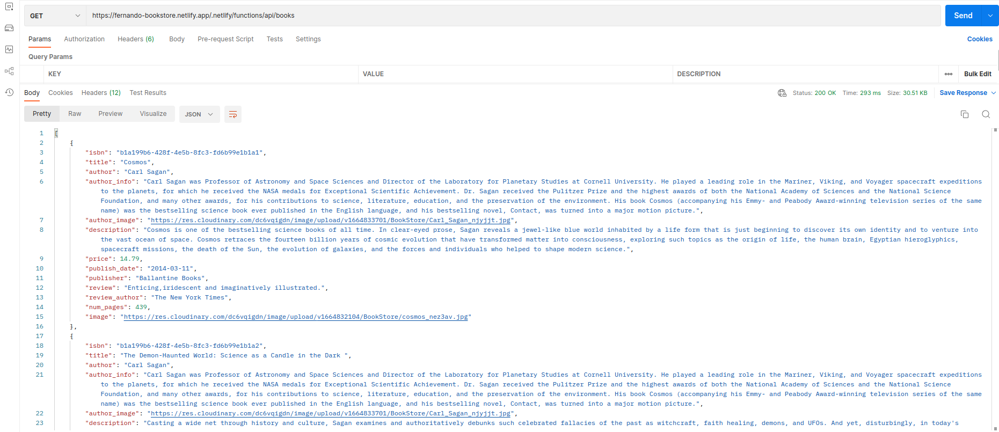
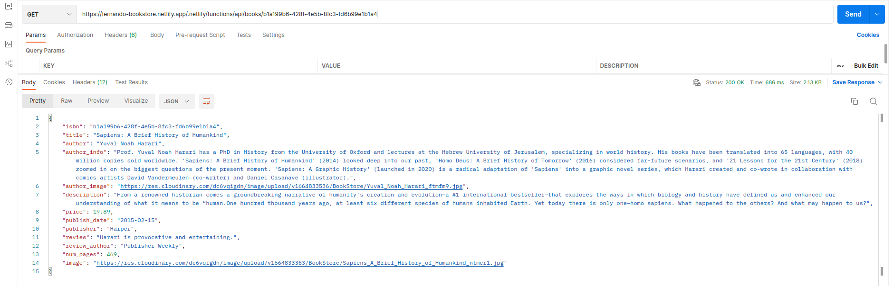
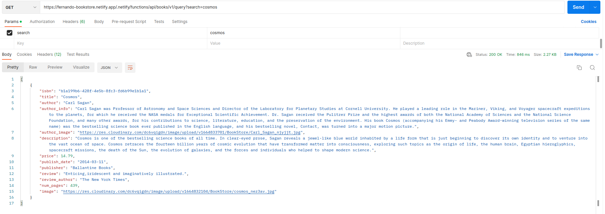
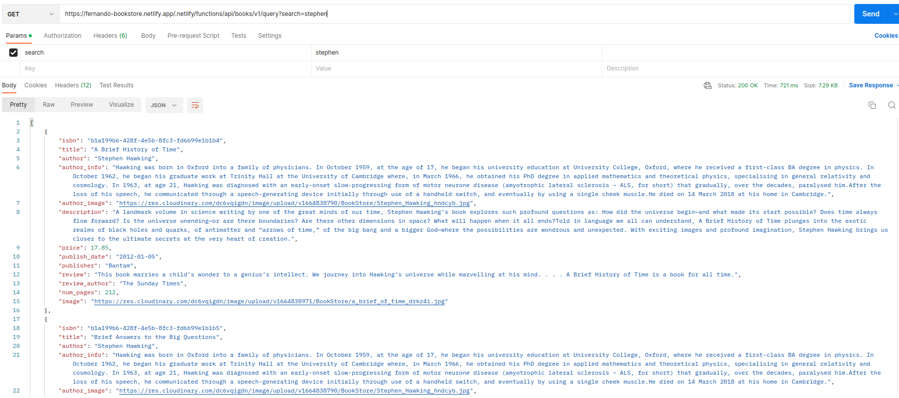
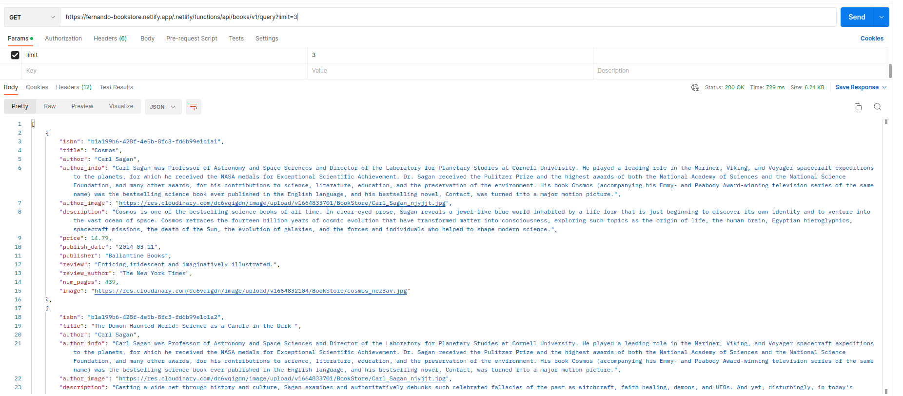

# Bookstore API
It's a REST API, build with Node.js and Express. I choose my favorite books and I created them. For the front-end, I will use React, Redux, and Tailwindcss.

    
## Built With
- Node.JS
- Express
  

## Instructions

- Get All Books [https://fernando-bookstore.netlify.app/.netlify/functions/api/books]

  
- Get a book by ISBN [https://fernando-bookstore.netlify.app/.netlify/functions/api/books/b1a199b6-428f-4e5b-8fc3-fd6b99e1b1a4]

  
- Search for a book by title [https://fernando-bookstore.netlify.app/.netlify/functions/api/books/v1/query?search=cosmos]

  
- Search for a book by author [https://fernando-bookstore.netlify.app/.netlify/functions/api/books/v1/query?search=stephen]

- Limit the number of books returned [https://fernando-bookstore.netlify.app/.netlify/functions/api/books/v1/query?limit=3]

## Author 👤

- GitHub: [@LuisSalas94](https://github.com/LuisSalas94)
- LinkedIn: [Fernando Salas](https://www.linkedin.com/in/luisfernandosalasgave/)
- Medium: [Fernando Salas](https://medium.com/@luisfernandosalasg)

## 🤝 Contributing

Contributions, issues, and feature requests are welcome!
Feel free to check the [issues page](../../issues/).

## Show your support

Give a ⭐️ if you like this project!

## 📝 License

This project is [MIT](./MIT.md) licensed.